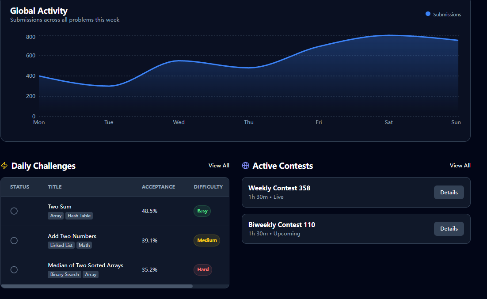
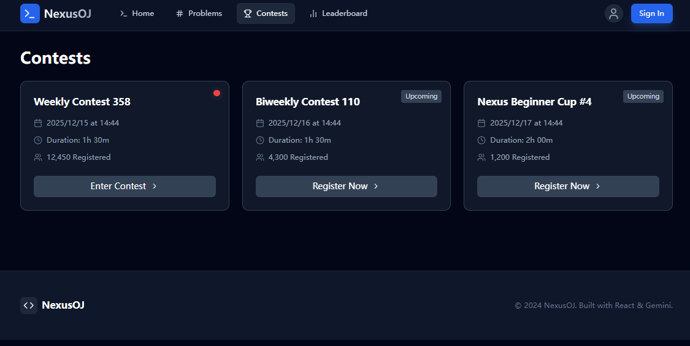

# NexusOJ 前端需求文档

## 网站描述

网站主体优先使用中文，可以支持切换成英语，优先light主体，可以切换成dark模式，拥有丝滑的动画效果。

一个AI助手，可以让用户询问算法范围以内的问题

网站主体是使用服务器判题(linux的系统调用seccomp,namespaces,cgroups),然后返回结果给用户,并且生成一条记录供用户查看

支持聊天系统，加好友建群，私聊，群聊，禁言,使用websocket，同时支持系统消息

网站还有奖励系统，例如每日签到，每日一题都可以获得丰厚的豆豆，用来兑换奖品

每个用户都可以发布博客、帖子来交流（Markdown格式，需要审核）

网站还有官方算法教程，分类讲述各种算法

用户可以把题目加入**待做清单**，**收藏夹**等等，网站也可以推出题单系统，把同一类型的题目放在一起供其他用户训练

判题系统目前支持Python,C++,Java,Rust,Go,Javascript,C

## 技术栈

涉及**vue3**, echarts, vue-router, element-plus,tailwindcss

使用ace editor(而不是monaco和codemirror)作为web editor

题目是markdown文档，而不是html或者文本类型，推荐使用v-md-editor

尽可能使用Flex布局或者Grid布局，支持在PC和手机端适应

## 后期方向

支持完整的IDE系统，类似CodePen

支持网盘系统，上传下载文件，预览文件,主要作用是建设一个虚拟文件系统，支持用户聊天的时候可以分享代码，比如模版，或者解题方法等等

主题切换，类似手机主题，优化网站页面，当下可以支持上传文件支持背景图

在用户实在想不出来的时候，每道题可以逐步给出小提示，引导用户思考

## 图片模版

以下图片均为暗黑模式

